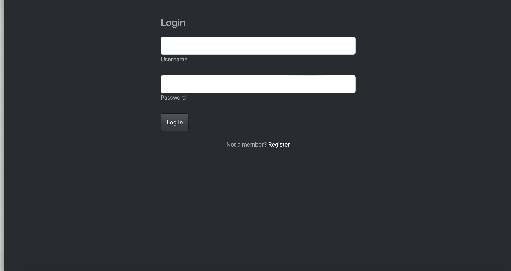
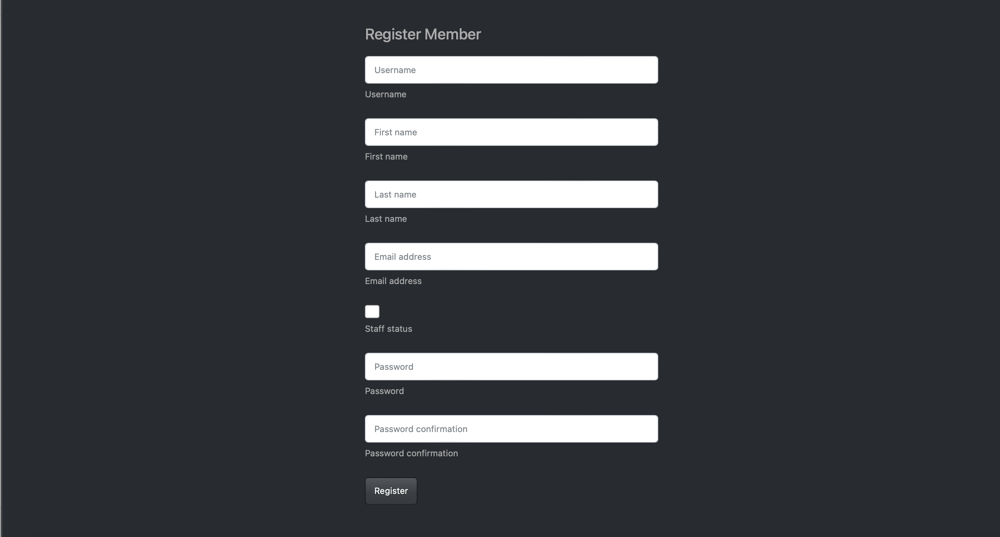
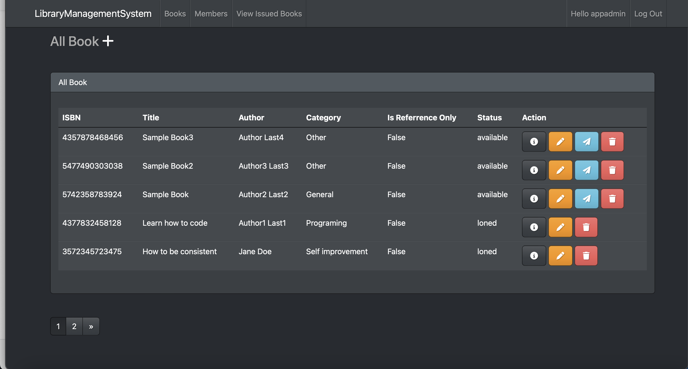
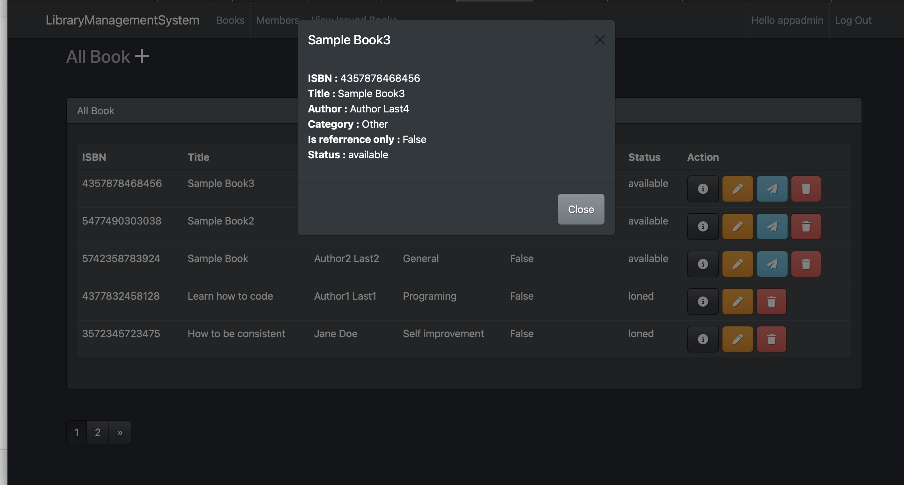
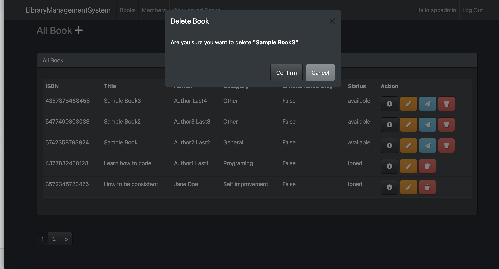
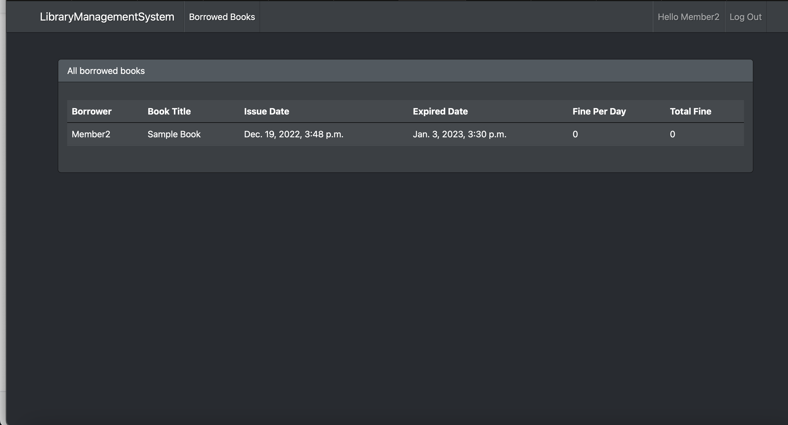

# LibraryMS-in-Django

This application is written by using Django for the backend, and HTML, Booststrap, JQuery for the frontend.
The purpose of this project is for learning to code.

## Features:
## Admin/Staff
- Register account/Login
- Add book, view book, edit book and delete book.
- Issue book to the library member, view issued book, edit issued book and delete issued book.
- Register new staff or member.

## Member
- Register account/Login.
- View book they have borrowed.

## Running application
- First you should have Python3.8 installed on your PC/Mac.
- Download this project zip file then extract on your PC/Mac desktop.
## On PC
- Open command prompt then change directory to project folder that you just extract on your PC desktop.
- Activate virtualenvironment by typing...
```
env\Scripts\Activate
```
- Then you should see something look like this...
```
(env) C:\Users\user\Desktop\LibraryMS>
```
- Then run following command...
```
python manage.py makemigrations
python manage.py migrate
python manage.py runserver
```
## On mac
- After extract LibraryMS on you mac desktop.
- Open mac terminal then change directory to LibraryMS folder.
- Activate virtualenvironment by typing...
```
source env/bin/activate
```
- Then you should see something look like this...
```
(env) yourusername-MacBook-Air LibraryMS % 
```
- Then run following command...
```
python3 manage.py makemigrations
python3 manage.py migrate
python3 manage.py runserver
```

## Home page
After running server addmin/staff or member will be redirected to this page.


## Login
#### Admin Username: appadmin / Admin Password: appadmin



## Register Page


## View all Book


## Single Book


## Edit Book


## Delete Book


## View Members


## View Issued Book


## For Member
## Member view book they have borrowed.

